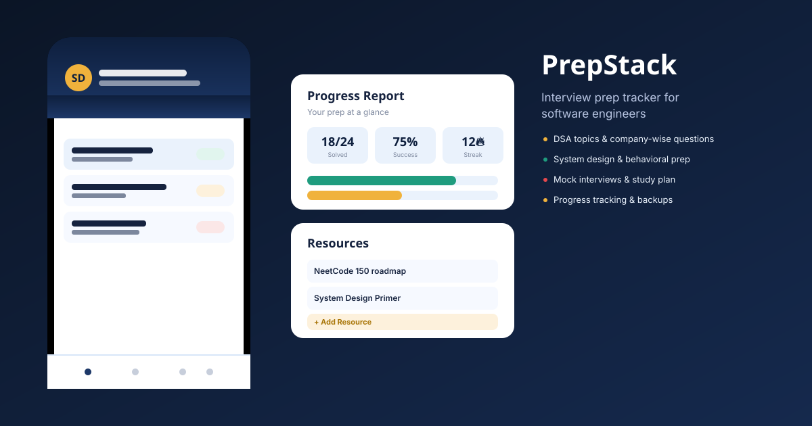

# PrepStack — Interview Prep Tracker



Repository: [su5867/prepstack-interview](https://github.com/su5867/prepstack-interview)

A mobile-style interview prep tracker for software engineers. Track DSA
practice by topic and by company, review system design and behavioral
questions, log mock interviews, keep a study plan, save notes and
resources, and see your progress at a glance — all in a single
phone-frame web app with no backend, build step, or dependencies
required.

## Features

- **DSA Topics** — Arrays, Linked Lists, Trees & Graphs, DP, Sorting,
  SQL — each with a live solved/total percentage. Drill into a topic
  for a searchable, filterable question list (by status and
  difficulty).
- **Company Wise Qs** — questions grouped by the company that asked
  them.
- **Daily Challenge** — one problem a day with a streak counter.
- **Bookmarked Qs** — star any question and pull them all up in one
  list.
- **Add your own questions** — from any topic, any company view, or
  the DSA Topics list itself, via a real in-app form (not a browser
  `prompt()`).
- **System Design / Behavioral / Mock Interviews / Study Plan** — tap
  any item to cycle its status (e.g. Not Started → In Progress →
  Reviewed). Add your own items to each through a form.
- **Resources** — real working links that open in a new tab and
  auto-mark themselves read. Add your own.
- **Mentors & Community** — a contacts list you can add to.
- **Progress Report** — an SVG bar chart plus stats across every
  module.
- **Reminders** — a notification-style inbox with an unread badge.
- **Dark mode** — toggle from *My Profile*; persists across sessions.
- **Responsive** — a focused, mobile-first app layout at every screen
  size.
- **Local sign-in** — create an account for this device and return to
  your saved prep workspace later.
- **Backup** — Export/Import your data as a JSON file from *My
  Profile*.
- **Persistence** — progress auto-saves to the browser's
  `localStorage` when deployed normally, so it survives a reload. (If
  this app is embedded inside a Claude artifact, it uses Claude's
  `window.storage` API instead — this is handled automatically.)

## Project structure

```
prepstack-interview/
├── index.html              # markup only
├── css/
│   └── styles.css          # all styling, incl. dark mode + responsive layout
├── js/
│   ├── logic.js            # pure functions — stats, filtering, status cycling (unit tested)
│   ├── data.js              # seed data, icons, module config
│   ├── storage.js            # persistence (localStorage / Claude window.storage)
│   └── app.js                # rendering, forms, routing, event wiring, init
├── tests/
│   ├── logic.test.js         # unit tests for js/logic.js (Node's built-in test runner)
│   └── smoke.node.js          # runs the whole app in a stubbed DOM to catch wiring bugs
├── assets/
│   └── preview.svg            # README hero graphic
├── .github/workflows/ci.yml    # runs the test suite on every push/PR
├── favicon.svg
├── package.json                # test scripts only — no runtime dependencies
├── LICENSE                     # MIT
└── README.md
```

No build step, no runtime dependencies, no framework — plain
HTML/CSS/JS. `package.json` only exists to define test scripts.

## Running locally

Just open `index.html` in a browser, or serve the folder with any
static server:

```bash
cd prepstack-interview
npm start
# or: python3 -m http.server 8000
# then visit http://localhost:8000
```

## Testing

```bash
npm test
```

This runs two things:
1. `tests/logic.test.js` — unit tests for the pure logic in
   `js/logic.js` (topic stats, filtering, status cycling, success
   rate) using Node's built-in `node:test` runner. No dependencies
   required.
2. `tests/smoke.node.js` — loads `index.html`'s scripts into a
   minimal stubbed DOM and exercises every major screen and action
   (opening each module, adding a question, toggling dark mode,
   exporting data, etc.) to catch broken references between files
   before they ever reach a browser.

Both run automatically on push/PR via GitHub Actions
(`.github/workflows/ci.yml`).

## Deploying to GitHub Pages

1. Push this folder's contents to the PrepStack repository:

   ```bash
   cd prepstack-interview
   git add .
   git commit -m "Update PrepStack"
   git push -u origin main
   ```

2. In the repo on GitHub, go to **Settings → Pages**.
3. Under **Build and deployment**, set **Source** to `Deploy from a
   branch`, branch `main`, folder `/ (root)`, then **Save**.
4. GitHub will publish the site at
   `https://su5867.github.io/prepstack-interview/` within a minute
   or two.

The repository URL is already configured in `package.json`.

## Notes on the sample data

All questions, companies, mock interview partners, and resource links
are placeholder/sample data meant to demonstrate the app — replace
them with your own via the "+ Add" buttons in each section, or edit
the arrays near the top of `js/data.js` directly.

## License

MIT — see [LICENSE](LICENSE).
